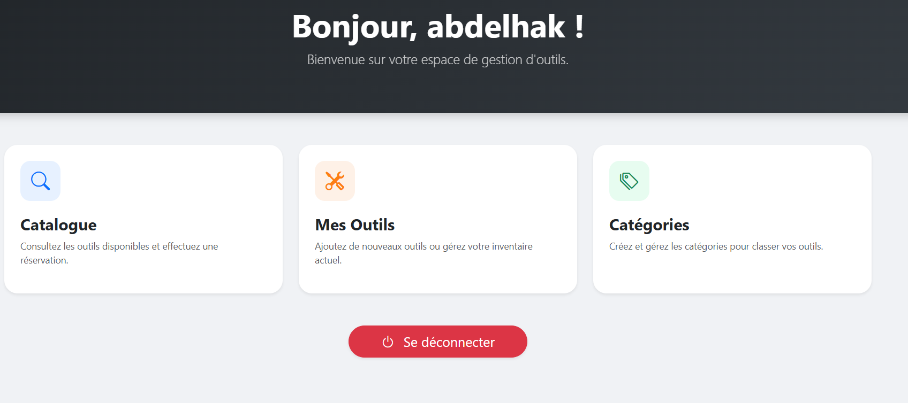
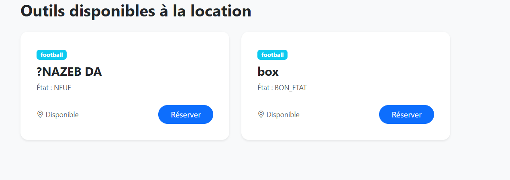
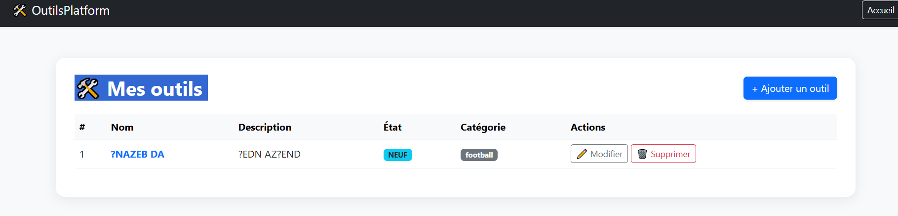

# OutilsPlatform 🛠️

Une application Spring Boot de partage d'outils entre particuliers.

## 🚀 Aperçu du projet

### 🏠 Accueil

### 📊 Tableau de bord

### 🔍 Catalogue des outils

### ⚙️ Gestion des outils

## 💻 Technologies utilisées
- **Backend** : Java 17, Spring Boot, Spring Data JPA
- **Frontend** : Thymeleaf, Bootstrap 5
- **Base de données** : MySQL / H2